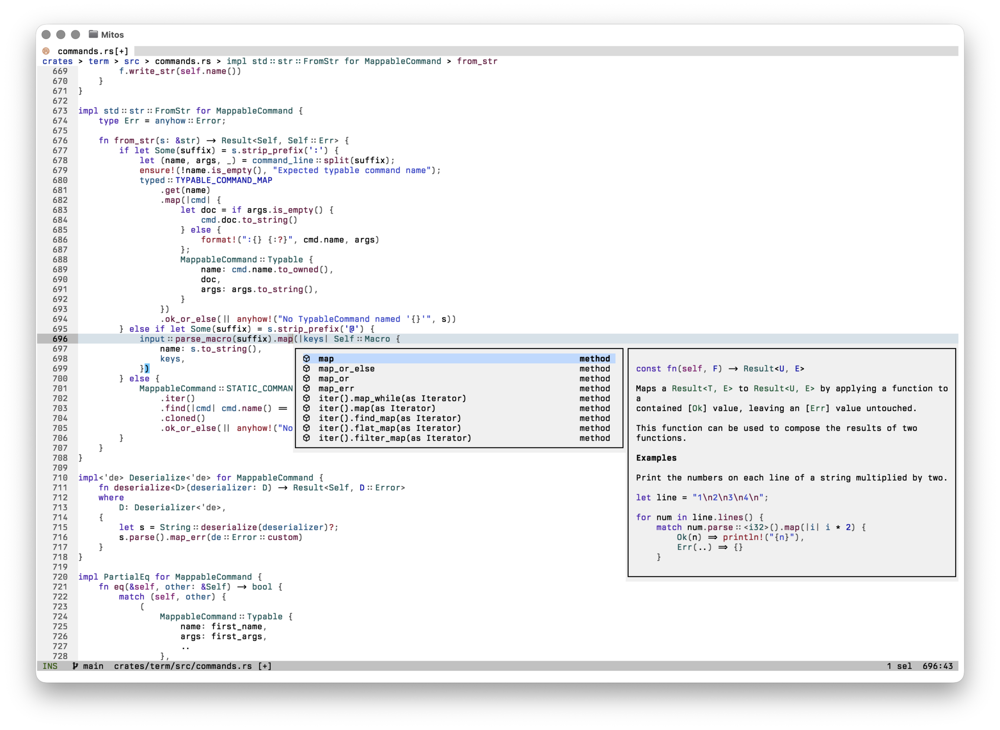

<div align="center">

# Mitos

[](https://github.com/mitos-editor/mitos/actions/workflows/build.yml)
[](./LICENSE)

</div>



Mitos is a modern, batteries-included, modal text editor written in Rust. It is a fork of [Helix](https://github.com/helix-editor/helix) and continues its selection-first editing model with multi-select, built-in language server support, and tree-sitter-powered syntax awareness.

## Features

- Selection-first modal editing
- Multiple selections
- Built-in language server and debug adapter support
- Incremental syntax highlighting and code editing via tree-sitter
- A terminal UI built with Ratatui

## Installation

On Linux and macOS:

```sh
curl -fsSL https://mitos.computer/install.sh | sh
```

On Windows, run in PowerShell:

```powershell
& ([scriptblock]::Create((Invoke-RestMethod https://mitos.computer/install.ps1)))
```

The installers select your platform, verify the download, and install the executable with its runtime for your user account.

Download a binary archive for Linux, macOS, or Windows from [GitHub Releases](https://github.com/mitos-editor/mitos/releases/latest). Extract it and keep `runtime/` beside `ms` (`ms.exe` on Windows), then add the extracted directory to your `PATH`.

With [mise](https://mise.jdx.dev/):

```sh
mise use -g github:mitos-editor/mitos@0.1.0
mise exec -- ms --health
```

See the [installation guide](https://mitos.computer/docs/install.html) for platform instructions.

### Building from Source

Mitos requires Rust 1.97.1 or newer.

```sh
git clone https://github.com/mitos-editor/mitos
cd mitos
cargo build --release
./target/release/ms --health
```

The optimized executable is written to `target/release/ms` (`ms` is short for Mitos). Install it on your `PATH` with `cargo install --path crates/term --locked`.

---

Mitos is a fork of [Helix](https://github.com/helix-editor/helix). The fork was created from commit `f9928f57f` and retains the complete upstream Git history.

The covered source files remain licensed under the Mozilla Public License 2.0 (`MPL-2.0`). The unmodified license text is distributed in [`LICENSE`](./LICENSE), and Cargo package metadata continues to declare `MPL-2.0`.

**Mitos is not endorsed by or affiliated with the Helix project or its maintainers.**
