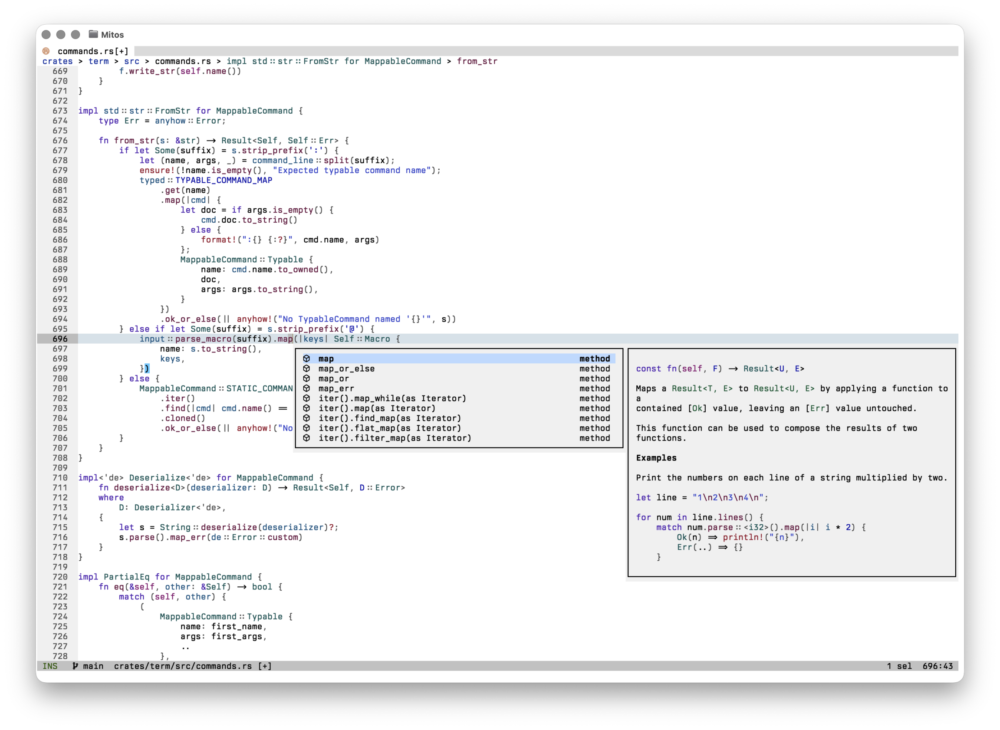

# Mitos

Mitos is a terminal text editor built around selections. Written in Rust and
based on Helix, it combines selection-first modal editing with multiple
selections, tree-sitter syntax awareness, and built-in language-server support.

[Start with the basics](./basics.md) · [Install Mitos](./install.md) ·
[View the source](https://github.com/mitos-editor/mitos)

```sh
ms --tutor
```



## At a glance

| | |
| --- | --- |
| Interface | Terminal |
| Editing model | Selection → action |
| Implementation | Rust + Ratatui |
| License | MPL-2.0 |

## What Mitos supports

### Editing

- Selection-first modal editing
- Multiple selections as a core operation
- Syntax-aware motions and textobjects
- Registers, macros, search, and surround operations

### Code intelligence

- Incremental parsing and highlighting with tree-sitter
- Built-in LSP client for completion and navigation
- Diagnostics, formatting, rename, and code actions
- Debug adapter support

### Workflow

- File, buffer, symbol, and diagnostic pickers
- Shell commands and selection pipelines
- Configurable keymaps, themes, and languages
- Workspace trust for project-local configuration

## Select first, then act

In Mitos, a cursor is a one-character selection. Motions change or extend that
selection, and commands operate on what is selected. The target of an edit is
visible before the edit happens.

Multiple selections use the same commands as a single selection. Select every
match, press `c`, and type once to change all of them:

1. Press `x` to select a line.
2. Press `s` to select regular-expression matches.
3. Press `c` to change every selection at once.

Learn more in [Basics](./basics.md).

## Where it fits

### Repeated and structural edits

Multiple selections and tree-sitter textobjects make related edits explicit
and let one command operate on every target.

### Programming with language tools

Use completion, diagnostics, symbol navigation, formatting, and code actions
through the built-in LSP client.

### Terminal-based workflows

Open files from the shell, pipe selections through commands, and keep editing
close to compilers, version control, and other tools.

## Start here

- [Installation](./install.md) — install a release or build Mitos from source.
- [Basics](./basics.md) — learn modes, movement, selections, and common commands.
- [Keymap](./keymap.md) — look up default bindings by mode and command.
- [Configuration](./configuration.md) — configure editor behavior, themes, keys, and languages.
- [Language servers](./lsp.md) — set up completion, diagnostics, formatting, and actions.
- [Commands](./commands.md) — browse typable and static commands.

## About Mitos

Mitos is an independent fork of [Helix](https://helix-editor.com/). It retains
the upstream Git history and continues Helix's selection-first editing model
while developing as a separate project.

The editor is open source under the Mozilla Public License 2.0. Mitos is not
endorsed by or affiliated with the Helix project or its maintainers.
